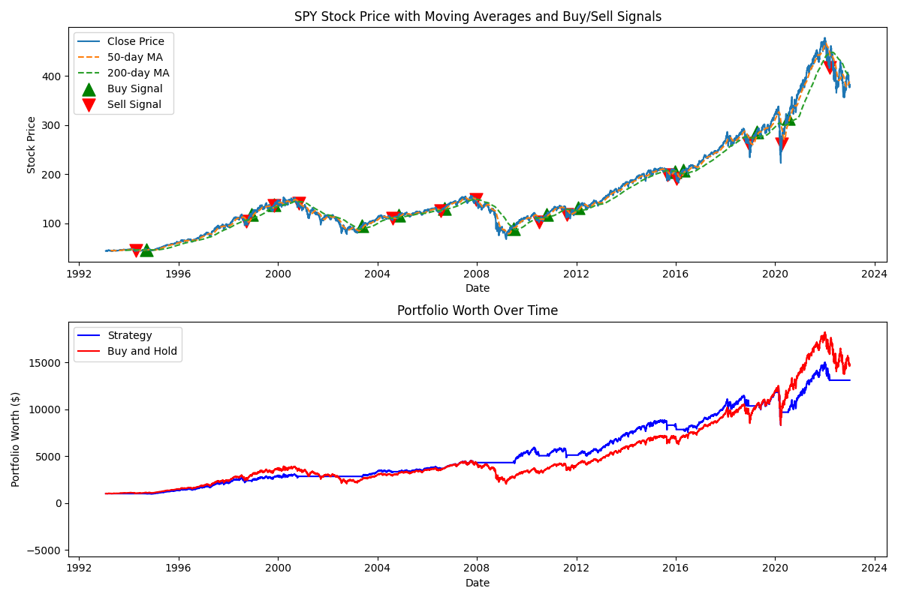
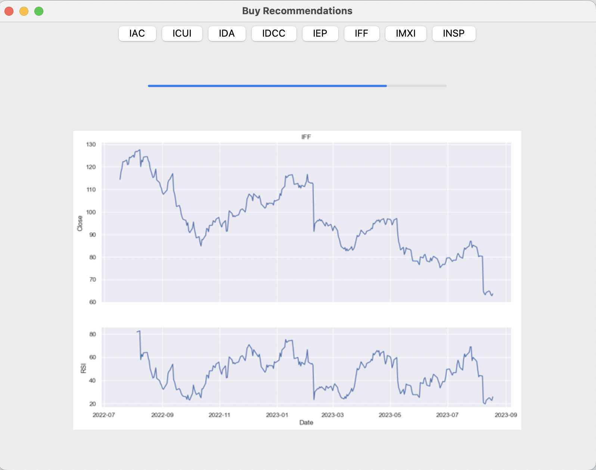

# BackTesting

## Brief Introduction

I once got in an argument with a friend. They claimed that if you bought/sold based on moving averages, then you would earn a greater return than simply buying and holding forever. They didn't believe me when I said that given enough time the market always wins, so I wrote a quick script to demonstrate.

Trading only SPY, here you buy whenever the 50 day moving average crosses above the 200, and sell when it crosses below.

The [Source](https://github.com/AviouslyK/backtest) for the above.

## Simple Mac App

I also implemented a related idea in the form of a Mac application that deploys a few simple trading strategies, and then gives suggestions on what tickers to buy.

The source for this can be found [here](https://github.com/AviouslyK/BuyTheDip/tree/main)