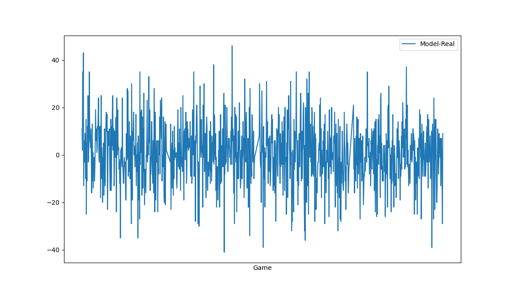
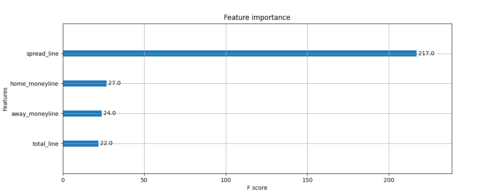

# A Simple Machine Learning algorithm to predict the outcome of NFL games - Implemented using Python

[Source](https://github.com/AviouslyK/BoostNFL)

## An Introduction: Responsible Sports Gambling

During the fall of 2022, I found myself more excited for the upcoming NFL season then usual. A sports betting app was running
a promotion: deposit $25, get $200 additionally to bet with. Being an avid NFL football fan, I thought a fun project might be 
to design a machine learning algorithm to predict the outcome of games each week. Then I can feel secure that my bets aren't based
on my own biases, but just the data. 

There was no expectation to beat Vegas of course, but getting $200 free from the onset means I should be able to at least break even ... right?

Let's find out.

# Building the model

## Obtaining and Cleaning the data
The first thing needed is a public dataset of all NFL games, with the teams, outcomes, and any other useful features. Thankfully, I found one online at [http://www.habitatring.com/games.csv](http://www.habitatring.com/games.csv), which has data from 1999 to the present, and is updated regularly.

To begin, we can use **pandas** to read in all the data from the website and put it into a DataFrame. We make two copies of the data, one will end up as our training data, and the other will be our testing/validation data. 

```python
import pandas as pd

# Read in public NFL dataset

# For Training and Validation
X_full = pd.read_csv("http://www.habitatring.com/games.csv") 
# For Testing
X_test_full = pd.read_csv("http://www.habitatring.com/games.csv") 
```

Now we separate out our Training and Validation Data, from our testing data. To start with, let's train and validate on all NFL games played before the 2019 season, Then we can test our performance on games played during and after 2019. 

To keep thing simple, let's also only consider regular season games - any NFL fan knows that _anything_ can happen in the playoffs, and we don't want to confuse our model!


```python 
# Remove rows with missing target
X_full = X_full.dropna( how='any', subset=['away_score','home_score','total','result'])

# Separate out Training/Validation data
X_full = X_full[X_full['game_type'] == "REG"] 
X_full = X_full[X_full['season'] < 2019]

# Separate out Testing Data
X_test_full = X_test_full[(X_test_full['season'] >= 2019) & (X_test_full['game_type'] == "REG")]

```

Now we want to separate the target from our predictors. In this case, our _target_, i.e. what w'ere trying to predict, will be the `result` column of the data, where `result = home_score - away_score`. 

```python
# separate target from predictors
y_test = X_test_full.result 
y = X_full.result 
X_full.drop(['result'], axis=1, inplace=True) # this is target
X_full.drop(['away_score'], axis=1, inplace=True) # these are directly related to target
X_full.drop(['home_score'], axis=1, inplace=True)
X_full.drop(['total'], axis=1, inplace=True) 
```

The next step is to separate out our Validation set from our Training set. When training a machine learning model, you need to calculate some measure of it's accuracy, before you go an apply it to real data. And of course, you can't use the same data you trained it on to evaluate it. There is a lot that could be said about the ideal ratio of training vs validation data, but in this case I will simply take 70% of the data pulled from before 2019, and use it for training. The other 30% will be used for validation.

We can use the **sklearn** package to easily execute this.

```python 
from sklearn.model_selection import train_test_split

# Break off validation set from training data
X_train_full, X_valid_full, y_train, y_valid = train_test_split(X_full, y, train_size=0.7, test_size=0.3, random_state=0)
```

Finally, the last step of data cleaning we need to do, is to convert any categorical data into numerical. Here I chose to one-hot encode the data. As an example this would convert 

| color | val |
|-------|-----|
| red   | 14  |
| blue  | 22  |
| white | 18  | 

into

| red | blue | white | val |
|-----|------|-------|-----|
| 1   | 0    | 0     | 14  |
| 0   | 1    | 0     | 22  |
| 0   |   0  | 1     | 18  |

Now we apply this quite simply:

```python
# Select numerical columns
numerical_cols = [cname for cname in X_train_full.columns if 
                X_train_full[cname].dtype in ['int64', 'float64']]

# Select categorical columns
categorical_cols = [cname for cname in X_train_full.columns if
                    X_train_full[cname].nunique() < 1000 and 
                    X_train_full[cname].dtype == "object" or X_train_full[cname].dtype == "string"]

# Keep selected columns only
my_cols = categorical_cols + numerical_cols
X_train = X_train_full[my_cols].copy()
X_valid = X_valid_full[my_cols].copy()
X_test = X_test_full[my_cols].copy()

# Save copies of the data before one-hot encoding, for showing results later on
X_train_OG = X_train
X_valid_OG = X_valid
X_test_OG = X_test

# One-hot encode the data (to shorten the code, we use pandas)
X_train = pd.get_dummies(X_train)
X_valid = pd.get_dummies(X_valid)
X_test = pd.get_dummies(X_test)
X_train, X_valid = X_train.align(X_valid, join='left', axis=1)
X_train, X_test = X_train.align(X_test, join='left', axis=1)
```

Now we can print out the data, and see what we have so far

```python
X_train.name = 'Training Set'
X_test.name = 'Test Set'

print('Number of Training Examples = {}'.format(X_train.shape[0]))
print('Number of Validation Examples = {}'.format(X_valid.shape[0]))
print('Number of Test Examples = {}\n'.format(X_test.shape[0]))

print(my_cols)
print("\n")
```

```plaintext
$ python boost_nfl.py

Number of Training Examples = 3567
Number of Validation Examples = 1529
Number of Test Examples = 1327

['game_type', 'gameday', 'weekday', 'gametime', 'away_team', 'home_team', 'location', 'nfl_detail_id', 'roof', 'surface', 'away_qb_id', 'home_qb_id', 'away_qb_name', 'home_qb_name', 'away_coach', 'home_coach', 'referee', 'stadium_id', 'stadium', 'season', 'week', 'overtime', 'old_game_id', 'gsis', 'pff', 'espn', 'away_rest', 'home_rest', 'away_moneyline', 'home_moneyline', 'spread_line', 'away_spread_odds', 'home_spread_odds', 'total_line', 'under_odds', 'over_odds', 'div_game', 'temp']
```

One of the most important parts of building a model is feature engineering, and as you can see we have a lot of features here. To make our lives easier later, as one last data cleaning step, let's remove all of the redundant columns we see here. So before we make the validation set, we can add

```python
# Remove redundant or not useful features, mostly IDs
X_full.drop(['game_id'], axis=1, inplace=True) 
X_full.drop(['old_game_id'], axis=1, inplace=True) 
X_full.drop(['pff'], axis=1, inplace=True) 
X_full.drop(['gsis'], axis=1, inplace=True) 
X_full.drop(['pfr'], axis=1, inplace=True) 
X_full.drop(['espn'], axis=1, inplace=True) 
X_full.drop(['stadium_id'], axis=1, inplace=True) # already have the name
X_full.drop(['away_qb_id'], axis=1, inplace=True) # already have their name
X_full.drop(['home_qb_id'], axis=1, inplace=True) 
X_full.drop(['nfl_detail_id'], axis=1, inplace=True)
```

Now to move on to the more fun part, defining and training the machine learning model!

## Defining and Training the Model

We can use a gradient boosting algorithm to train the model, called XGBoost. In short, it combines several weaker models 
into one stronger ensemble model. It works iteratively, calculating how close its predictions were to data, and creating and adding trees to the model to minimize this _loss_. We need to define some parameters that control how the model will learn.

```python
from xgboost import XGBRegressor

# Define the model
model = XGBRegressor(n_estimators=100, learning_rate=0.025,  early_stopping_rounds=4, max_depth=3, subsample=0.85)
```

Here, `n_estimators` is the number of boosted trees that make up our ensemble. `learning_rate` controls the weighting of new trees added to the model, and can be set low to prevent over-fitting. `early_stopping_rounds` sets when to stop iterating if the performance hasn't improved, so in this example after 4 iterations of no decrease in the loss, we will stop adding trees to the model. This will also prevent over-fitting. 

`max_depth` controls the maximum depth of each tree in the model. The larger the depth, the more complex the model, and also the more likely it will overfit. Lastly, `subsample` also prevents over-fitting, here it tells XGBoost to randomly sample 85% of the training data for each iteration of the boosting process. This leads to faster training, and can also improve performance as by introducing some randomness so that the model becomes less likely to fit noise and focuses on more meaningful patterns.

Now we are ready to train the model! We use out previously partitioned out training data, and evaluate it's performance using the validation data. 

```python
# Fit the model
model.fit(X_train, y_train, eval_set=[(X_valid, y_valid)], verbose=False)
# Get predictions
preds = model.predict(X_valid)
print('MAE:', mean_absolute_error(y_valid, preds))
print('MSE:', mean_squared_error(y_valid, preds))
```

Here we print out the mean absolute error and the mean squared error, two common performance metrics.

In this case, we find that 
```
MAE: 10.57
MSE: 180.40
```

So on average, the model's prediction of the result of the game (home score - away score) on validation data, was off by about 10-11 points.

If instead we took the difference in predicted and truth, squared it, and _then_ took the average, we would end up with 180.4

For more fun, we can try and tune our parameters to see if we can improve the performance. For now though, let's make predictions on our test data - games from 2019 onwards - and see how we do:

```python
# Predict Test Data
df_total = pd.concat([y_test, X_test_OG], axis=1)
df_total["Pred"] = model.predict(X_test)
df_total.Pred = df_total.Pred.round()

df_total = df_total[ ['Pred'] + [ col for col in df_total.columns if col != 'Pred' ] ]
df_total.to_csv('boosted_prediction.csv')

# Plot prediction vs actual 
df_total["Game"] = df_total.index
df_total["Model-Real"] = df_total["Pred"] - df_total["result"]
plot = df_total.plot(x="Game",y="Model-Real")
fig = plot.get_figure()
fig.savefig("boosted_output2.png")
```



The plot is consistent with an average of 10-11 points from the true value, but occasionally is off by even more.

One useful thing to do would be to plot the feature importance, to see what is having the largest affect on our model.

```python
# Investigate Feature Importance
g = plot_importance(model, importance_type='weight', max_num_features=4)
fig = g.get_figure()
fig.savefig("feat_import.png")
plt.show()
```


Uh oh! It looks like whether or not the game went to overtime is the second most important feature in the model. This should have been dropped from the data in the beginning, when we dropped  other features directly related to the target. Of course the model will learn that if a game went to overtime, the scores must have been close together, but this won't help it predict future outcomes, since it's unknown whether those games will go to overtime or not. So we add

```python
X_full.drop(['overtime'], axis=1, inplace=True) 
```

and run again. 



Ah this makes more sense. The features with the biggest impact on our model are those associated with vegas score predictions, as we might expect.