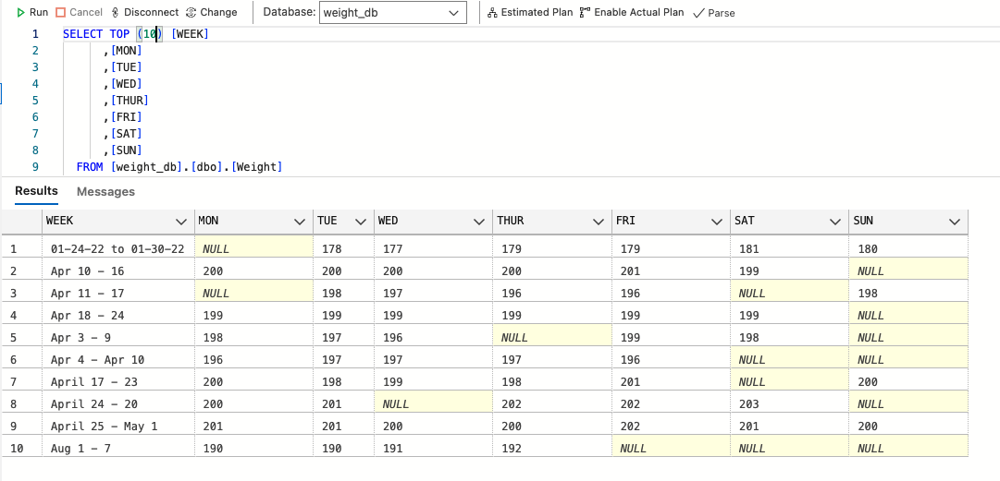
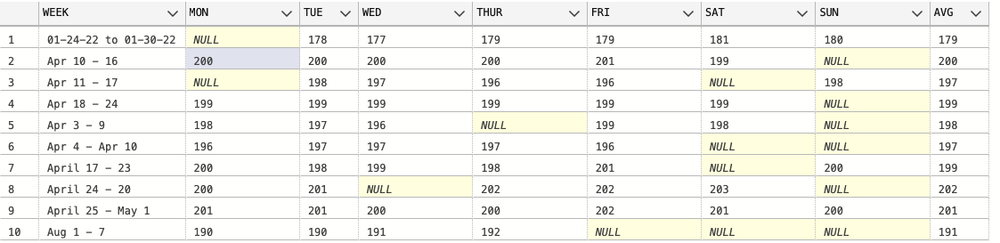
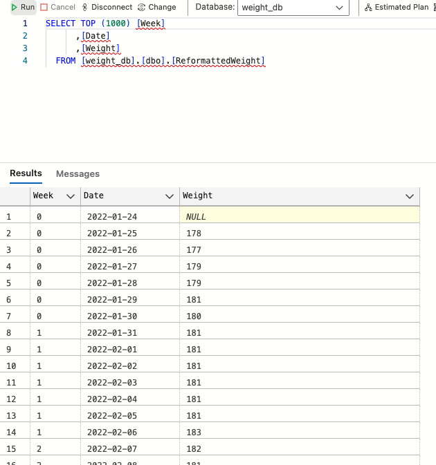

# Creating a SQL server, and database using Python, Docker, and Azure Data Studio


This was a personal project I embarked on to get more familiar with SQL. For a long time I've been tracking my weight on Excel . In this project I would like to set up a server, create a database, and then transfer all the information on my weight I've collected to that database - using SQL and Python.

## Install a SQL server 
Because I'm on a macOS I can't natively support Microsoft programs, I need to download and install Docker [(https://www.docker.com)](https://www.docker.com) first.
Next I'll install Azure Data Studio [(https://azure.microsoft.com/en-us/products/data-studio)](https://azure.microsoft.com/en-us/products/data-studio) to manage the server. 

Now that all the prerequisites are out of the way, let's begin. We first use Docker to pull a Microsoft hosted Docker image azure-sql-edge. So in the terminal execute

```bash
docker pull mcr.microsoft.com/azure-sql-edge
```

Then to start running the server

```bash
docker run -d —-name MySQLServer -e ‘ACCEPT_EULA=Y’ -e ‘SA_PASSWORD=your_password123’ -p 1433:1433 mcr.microsoft.com/azure-sql-edge
```

If you open the Docker Desktop application, you should see the status of the server as `Running`


## Create a Database

Moving to Azure Data Studio, you can open a *New Connection* and fill out the appropriate Connection Details


Then you can right click on the new server **localhost** and select **New Query** and create a new database, and a new table

```sql
CREATE DATABASE weight_db;

CREATE TABLE [dbo].[Weight] (
    [WEEK] VARCHAR (50) NOT NULL,
    [MON]  DECIMAL (18) NULL,
    [TUE]  DECIMAL (18) NULL,
    [WED]  DECIMAL (18) NULL,
    [THUR] DECIMAL (18) NULL,
    [FRI]  DECIMAL (18) NULL,
    [SAT]  DECIMAL (18) NULL,
    [SUN]  DECIMAL (18) NULL,
    CONSTRAINT [PK_Weight] PRIMARY KEY CLUSTERED ([WEEK] ASC)
);
```

Here each entry represents one week and has the values for my weight I recorded each day of that week. The week is a string and it serves as the primary key of the table. I may go on vacation or forget a day, so of course some days in a week can be `NULL`.

## Populate the Database

Now we want to efficiently populate this table, reading in values from a csv file. We can use python in combination with SQL to efficiently do this.

The plan is to use the **pyodbc** python package to access the Database from a python script, but there is one prerequisite that we must do first. 

We have to install the ODBC Driver, which will allow us to connect to our SQL server within the python script. To do this execute in the terminal

```bash
brew tap microsoft/mssql-release https://github.com/Microsoft/homebrew-mssql-release
brew update
brew install msodbcsql17 mssql-tools
```

No let's test that everything is working. Create a new python script *populate.py*:

```python
import pyodbc
server = 'localhost'
database = 'weight_db'
username = 'sa'
password = 'your_password123’'
driver = '/usr/local/lib/libmsodbcsql.17.dylib'
# driver = 'ODBC Driver 17 for SQL Server' # sym link not working, I need to put actual path
cnxn = pyodbc.connect('DRIVER='+driver+';SERVER='+server+';DATABASE='+database+';UID='+username+';PWD='+ password)
cursor = cnxn.cursor()

cursor.execute('''
                INSERT INTO Weight (WEEK, MON, TUE, WED, THUR, FRI, SAT, SUN)
                VALUES
                ('01-24-22 to 01-30-22',NULL,178,177.2,178.6,178.8,180.6,180.4)
                ''')
cnxn.commit()
```

For some reason the link to my driver was not working, so I had to put the global path, but I left the standard solution as a comment. When we execute this, we should get no error messages, meaning we successfully connected to the server, and accessed the database.

To see if the new row has been added, we can open Azure Data Studio and use a simply Query


Or we can check using python:

```python
import pyodbc
server = 'localhost'
database = 'weight_db'
username = 'sa'
password = '!charmstrange!'
# driver = 'ODBC Driver 17 for SQL Server' # usually this is ok
driver = '/usr/local/lib/libmsodbcsql.17.dylib' # but I had to do this
cnxn = pyodbc.connect('DRIVER='+driver+';SERVER='+server+';DATABASE='+database+';UID='+username+';PWD='+ password)
cursor = cnxn.cursor()

cursor.execute('SELECT * FROM Weight')
 
for i in cursor:
    print(i)
```
```plaintext
$ python populate.py
('01-24-22 to 01-30-22', None, Decimal('178'), Decimal('177'), Decimal('179'), Decimal('179'), Decimal('181'), Decimal('180'))
```

This was also a nice test of inserting a week of weight measurements where one day's data was missing.

But of course, we don't want to manually insert the data by hand, instead let's read in the data from an excel file, and then add it to our table.

```python
# For handling empty cells
def convert_empty_to_none(value):
    if isinstance(value, float) and math.isnan(value):
        return None
    return value

# Read the Excel file using pandas
excel_file_path = 'flatWeight.xlsx'
df = pd.read_excel(excel_file_path, index_col=0) 

# From df to db
for index, row in df.iterrows():
    week = index
    mon, tue, wed, thur, fri, sat, sun = map(convert_empty_to_none, row.values)

    # Insert weights into the table
    cursor.execute('INSERT INTO Weight (Week, MON, TUE, WED, THUR, FRI, SAT, SUN) VALUES (?, ?, ?, ?, ?, ?, ?, ?)',
                   week, mon, tue, wed, thur, fri, sat, sun)
    cnxn.commit()  # Commit changes for each week

cursor.close()
cnxn.close()
```

Note, we had to add a function to convert all of our empty cells to a `None` value, so that we don't get an error from our SQL server like "The supplied value is not a valid instance of data type float."

Now we have all of the data that used to be in excel saved in our database! We can do a simple query and look at the first few entries 



Now to add a new column to our table that contains the average weight of that week, we can run

```python
# Add a new column "Avg" to the SQL table
alter_query = '''
ALTER TABLE Weight
ADD Avg DECIMAL;
'''
cursor.execute(alter_query)
cnxn.commit()

# Calculate and update the average weight for each week
update_query = '''
UPDATE Weight
SET Avg = (
    (ISNULL(MON, 0) + ISNULL(TUE, 0) + ISNULL(WED, 0) + ISNULL(THUR, 0) +
    ISNULL(FRI, 0) + ISNULL(SAT, 0) + ISNULL(SUN, 0))
    /
    (CASE WHEN MON IS NOT NULL THEN 1 ELSE 0 END +
    CASE WHEN TUE IS NOT NULL THEN 1 ELSE 0 END +
    CASE WHEN WED IS NOT NULL THEN 1 ELSE 0 END +
    CASE WHEN THUR IS NOT NULL THEN 1 ELSE 0 END +
    CASE WHEN FRI IS NOT NULL THEN 1 ELSE 0 END +
    CASE WHEN SAT IS NOT NULL THEN 1 ELSE 0 END +
    CASE WHEN SUN IS NOT NULL THEN 1 ELSE 0 END)
)
WHERE MON IS NOT NULL OR TUE IS NOT NULL OR WED IS NOT NULL OR
      THUR IS NOT NULL OR FRI IS NOT NULL OR SAT IS NOT NULL OR SUN IS NOT NULL;
'''
# add where clause at end to ensure we don't do this when all the columns are null
cursor.execute(update_query)
cnxn.commit()
```
Where we had to be careful to only calculate the average from days of the week that had a weight in them, and make sure we didn't divide by zero. 



Now looking at this table, it is a bit silly the way it's organized. The day of the week could just be found from the date. So why don't we make a new TABLE with more useful formatting.

```python
import pyodbc
import pandas as pd
import math
from datetime import datetime, timedelta

server = 'localhost'
database = 'weight_db'
username = 'sa'
password = '!charmstrange!'
driver = '/usr/local/lib/libmsodbcsql.17.dylib'
# driver = 'ODBC Driver 17 for SQL Server' # sym link not working, I need to put actual path
cnxn = pyodbc.connect('DRIVER='+driver+';SERVER='+server+';DATABASE='+database+';UID='+username+';PWD='+ password)
cursor = cnxn.cursor()

# Read the Excel file using pandas
excel_file_path = 'flatWeight.xlsx'
df = pd.read_excel(excel_file_path, index_col=0) 

cursor.execute("CREATE TABLE ReformattedWeight (Week INT, Date DATE PRIMARY KEY, Weight DECIMAL)")

# I didn't put the year in the data originally, but I know it begins in 2022
# I'll increment it after I see january
current_year = 2022
changed_year = False

# How many weeks
week_counter = 0

for index, row in df.iterrows():
    week = index
    values = row.values[:]  # Extracting weight values from Monday to Sunday
    avg_weight = row.values[-1]  # The last value is the average weight
    
    # Getting the date of each day from the week string
    week_parts = week.split(' ')
    if week_parts[0] == 'Jan' and week_parts[1] == '2' and not changed_year:
        current_year = current_year + 1
        changed_year = True # only do this twice

    start_date = week_parts[0] + ' ' + week_parts[1] + ' ' + str(current_year)
    
    # Try different format specifiers for parsing month names (Jun vs June)
    for format_specifier in ['%B %d %Y', '%b %d %Y']:
        try:
            # Attempt to parse the date using the current format specifier
            start_date = datetime.strptime(start_date, format_specifier)
            break  # Break out of the loop if parsing succeeds
        except ValueError:
            continue  # Try the next format specifier if parsing fails

    # Inserting data into the ReformattedWeight table
    for i, value in enumerate(values):
        # Adding i days to the start of the week, to get the date of each workout
        days_to_add = i
        new_date = start_date + timedelta(days=days_to_add)

        # handle empty cells
        value = convert_empty_to_none(value)

        cursor.execute("INSERT INTO ReformattedWeight (Week, Date, Weight) VALUES (?, ?, ?)", (week_counter, new_date, value))

    week_counter = week_counter + 1
    
# Committing the changes and closing the connection
cnxn.commit()
cnxn.close()
```

Here we can use the data of each weight entry as the `PRIMARY KEY`. Much better

