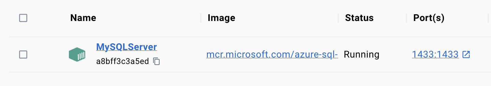
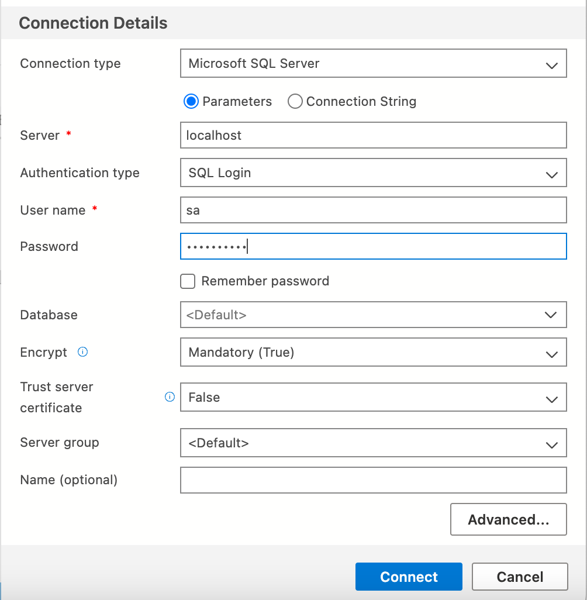
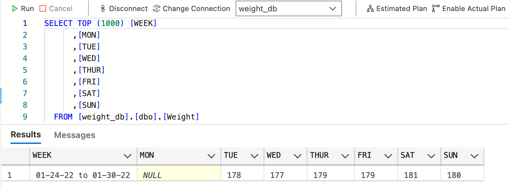

# Creating a SQL server, and database using Python, Docker, and Azure Data Studio


This was a personal project I embarked on to get more familiar with SQL. For a long time I've been tracking my weight on Excel . In this project I would like to set up a server, create a database, and then transfer all the information on my weight I've collected to that database - using SQL and Python.

## Install a SQL server 
Because I'm on a macOS I can't natively support Microsoft programs, I need to download and install Docker [(https://www.docker.com)](https://www.docker.com) first.
Next I'll install Azure Data Studio [(https://azure.microsoft.com/en-us/products/data-studio)](https://azure.microsoft.com/en-us/products/data-studio) to manage the server. 

Now that all the prequisistes are out of the way, let's being. We first use Docker to pull a Microsoft hosted Docker image azure-sql-edge. So in the terminal execute

```bash
docker pull mcr.microsoft.com/azure-sql-edge
```

Then to start running the server

```bash
docker run -d —-name MySQLServer -e ‘ACCEPT_EULA=Y’ -e ‘SA_PASSWORD=your_password123’ -p 1433:1433 mcr.microsoft.com/azure-sql-edge
```

If you open the Docker Desktop application, you should see the status of the server as `Running`




## Create a Database

Moving to Azure Data Studio, you can open a *New Connection* and fill out the appropriate Connection Details



Then you can right click on the new server **localhost** and select **New Query** and create a new database, and a new table

```sql
CREATE DATABASE weight_db;

CREATE TABLE [dbo].[Weight] (
    [WEEK] VARCHAR (50) NOT NULL,
    [MON]  DECIMAL (18) NULL,
    [TUE]  DECIMAL (18) NULL,
    [WED]  DECIMAL (18) NULL,
    [THUR] DECIMAL (18) NULL,
    [FRI]  DECIMAL (18) NULL,
    [SAT]  DECIMAL (18) NULL,
    [SUN]  DECIMAL (18) NULL,
    CONSTRAINT [PK_Weight] PRIMARY KEY CLUSTERED ([WEEK] ASC)
);
```

Here each entry represents one week and has the values for my weight I recorded each day of that week. The week is a string and it serves as the primary key of the table. I may go on vacation or forget a day, so of course some days in a week can be `NULL`.

## Populate the Database

Now we want to efficiently populate this table, reading in values from a csv file. We can use python in combination with SQL to efficiently do this.

The plan is to use the **pyodbc** python package to access the Database from a python script, but there is one prerequisite that we must do first. 

We have to install the ODBC Driver, which will allow us to connect to our SQL server within the python script. To do this execute in the terminal

```bash
brew tap microsoft/mssql-release https://github.com/Microsoft/homebrew-mssql-release
brew update
brew install msodbcsql17 mssql-tools
```

No let's test that everything is working. Create a new python script *populate.py*:

```python
import pyodbc
server = 'localhost'
database = 'weight_db'
username = 'sa'
password = 'your_password123’'
driver = '/usr/local/lib/libmsodbcsql.17.dylib'
# driver = 'ODBC Driver 17 for SQL Server' # sym link not working, I need to put actual path
cnxn = pyodbc.connect('DRIVER='+driver+';SERVER='+server+';DATABASE='+database+';UID='+username+';PWD='+ password)
cursor = cnxn.cursor()

cursor.execute('''
                INSERT INTO Weight (WEEK, MON, TUE, WED, THUR, FRI, SAT, SUN)
                VALUES
                ('01-24-22 to 01-30-22',NULL,178,177.2,178.6,178.8,180.6,180.4)
                ''')
cnxn.commit()
```

For some reason the link to my driver was not working, so I had to put the global path, but I left the standard solution as a comment. When we execute this, we should get no error messages, meaning we successfully connected to the server, and accessed the database.

To see if the new row has been added, we can open Azure Data Studio and use a simply Query



Or we can check using python:

```python
import pyodbc
server = 'localhost'
database = 'weight_db'
username = 'sa'
password = '!charmstrange!'
driver = '/usr/local/lib/libmsodbcsql.17.dylib'
# driver = 'ODBC Driver 17 for SQL Server' # sym link not working, I need to put actual path
cnxn = pyodbc.connect('DRIVER='+driver+';SERVER='+server+';DATABASE='+database+';UID='+username+';PWD='+ password)
cursor = cnxn.cursor()

cursor.execute('SELECT * FROM Weight')
 
for i in cursor:
    print(i)
```
```plaintext
$ python populate.py
('01-24-22 to 01-30-22', None, Decimal('178'), Decimal('177'), Decimal('179'), Decimal('179'), Decimal('181'), Decimal('180'))
```

This was also a nice test of inserting a week of weight measurements where one day's data was missing.